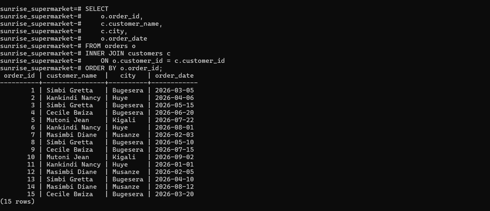
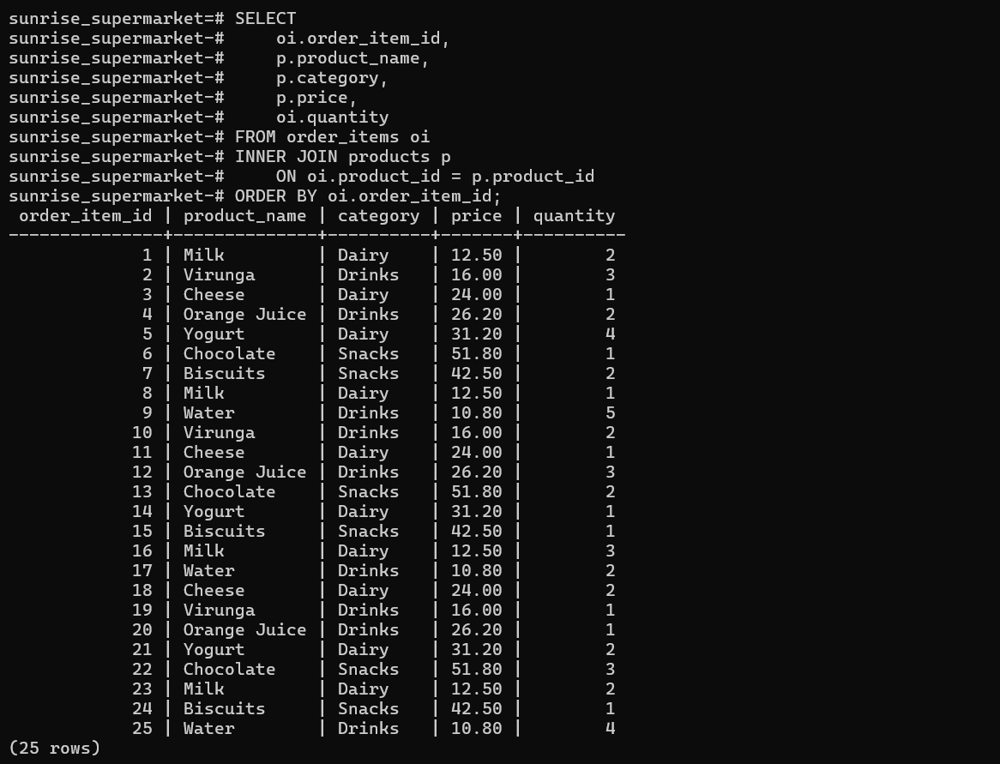
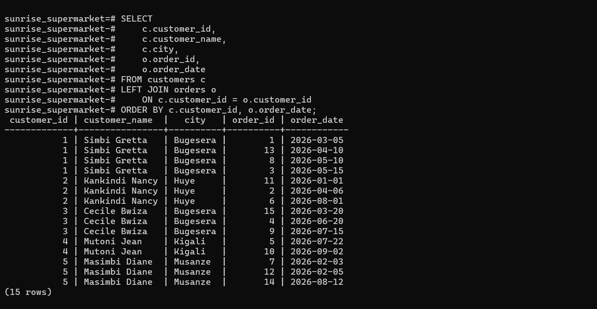
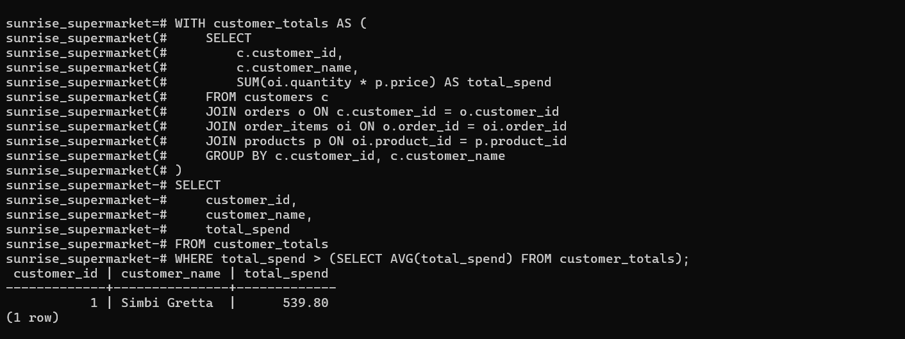
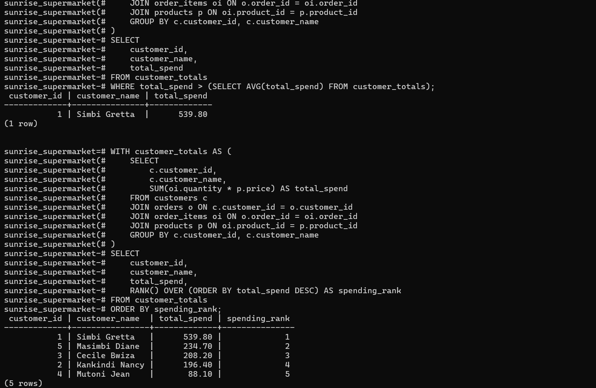
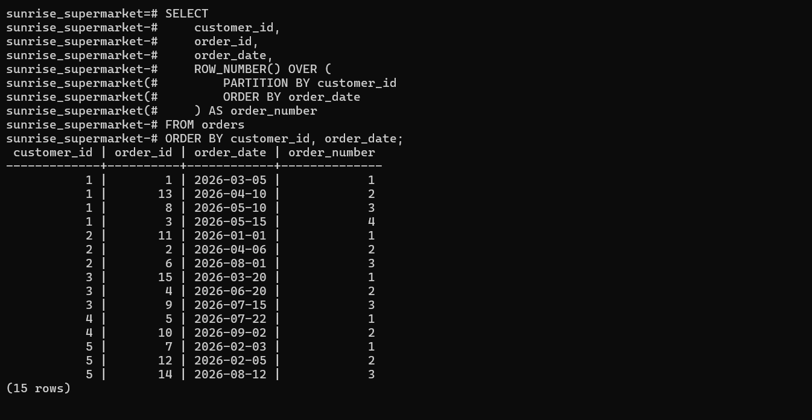
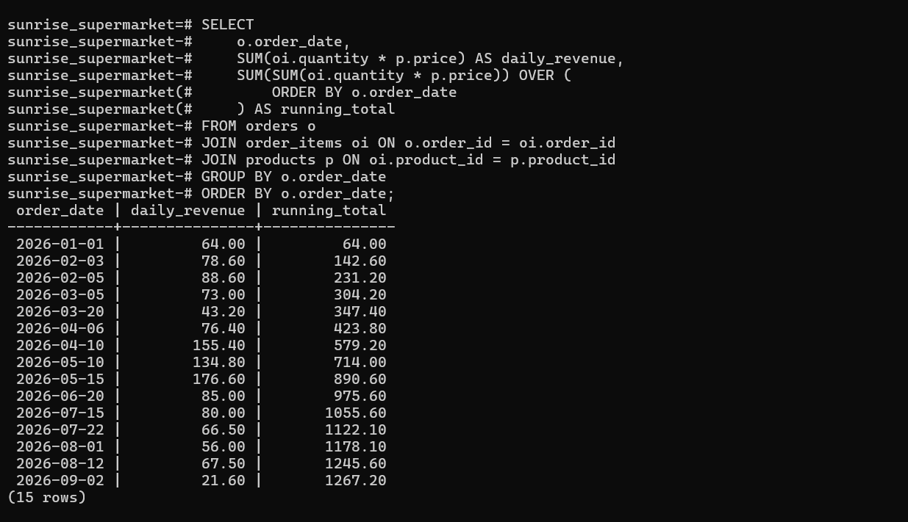
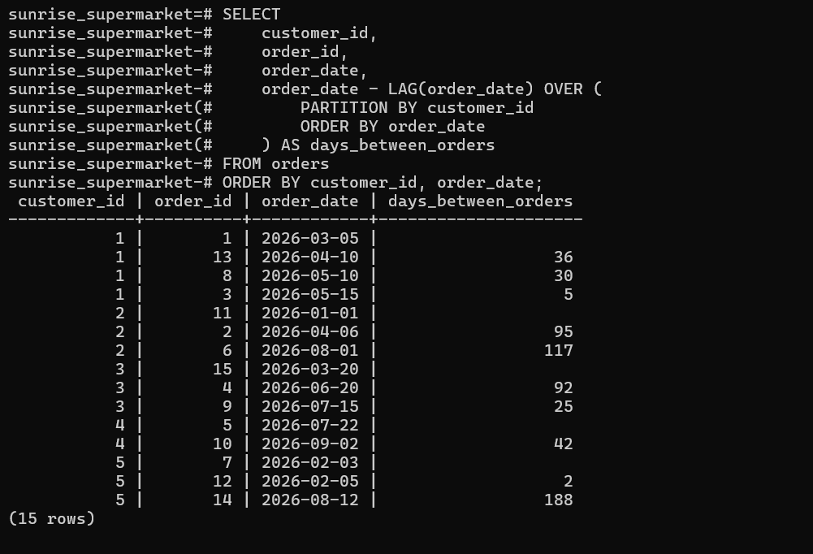

# PL/SQL Assignment 1

**Name:** Ishimwe Jessica 
**Student ID:** 20251SEN222
**Group:** Group B  

## 1. Introduction

This project analyzes sales data for Sunrise Supermarket using SQL. 
The database contains customers, products, orders, and order items.

## 2. Database Tables and System Used

The project contains four tables:

- **Customers** – stores customer information.
- **Products** – stores products, categories, and prices.
- **Orders** – stores customer orders and order dates.
- **Order_Items** – stores the products and quantities included in each order.

The database was populated with:

- 5 customers
- 8 products
- 15 orders
- 25 order items

This project was implemented and tested using PostgreSQL.

## 3. JOIN Queries

### Query 1 – Orders and Customers

This query connects the orders and customers tables to show which customer placed each order.

### Query 2 – Order Items and Products

This query connects order items with products to show the products included in each order.

### Query 3 – Customers and Orders

This query connects customers with their orders and shows all customers, even if they have no orders.

## 4. CTE Query

The CTE calculates the total amount spent by each customer and then finds customers whose spending is above the average.

**Result:** The query identifies the customers who spent more than the average customer spending.

## 5. Window Functions

### Query 1 – Customer Spending Rank

This query ranks customers according to their total spending, with the highest spending receiving the highest rank.

### Query 2 – Order Numbering

This query numbers each customer's orders according to the order date.

### Query 3 – Running Revenue

This query calculates the revenue for each date and the running total of revenue over time.

### Query 4 – Days Between Orders

This query calculates the number of days between a customer's current order and their previous order.

## 6. Business Interpretation

The queries help Sunrise Supermarket understand customer spending, ordering patterns, and revenue over time. This information can help the business monitor sales and understand customer purchasing behavior.

## 7. Challenges and Solutions Used

One challenge was working with several related tables. I used primary and foreign keys to correctly connect the tables and make sure the queries returned the required information.

## 8. Conclusion

The project demonstrates how SQL JOINs, CTEs, and window functions can be used to analyze supermarket sales data and produce useful business information.
